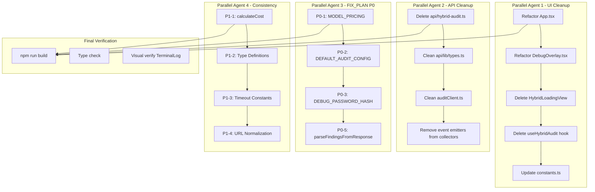

# Clean Rebuild Architecture Plan

## Goal
Remove the hybrid audit system completely while keeping the original TerminalLog (green text) component intact, and clean up all code duplication identified in FIX_PLAN.md.

## Architecture Overview



## Files to Delete

| File | Reason |
|------|--------|
| `src/components/HybridLoadingView.tsx` | Replaced by TerminalLog |
| `src/hooks/useHybridAudit.ts` | Hook for deleted hybrid system |
| `api/hybrid-audit.ts` | API endpoint for hybrid system |

## Files to Modify (Major)

### Agent 1: Frontend
- `App.tsx` - Remove `useHybridMode` state, hybrid imports, hybrid conditional logic
- `components/DebugOverlay.tsx` - Remove hybrid props, hybrid tab, hybrid UI
- `src/lib/constants.ts` - Remove `HYBRID_AUDIT` endpoint
- `src/services/auditClient.ts` - Remove `runHybridAudit` function and types

### Agent 2: Backend Types
- `api/lib/types.ts` - Remove all HybridAudit types (lines 428-600+)

### Agent 3: FIX_PLAN P0 Tasks
- `api/lib/providers/types.ts` - Keep as canonical MODEL_PRICING source
- `api/audit.ts` - Remove duplicate MODEL_PRICING, DEFAULT_AUDIT_CONFIG
- `src/lib/pricing.ts` - Re-export from canonical source
- `src/lib/constants.ts` - Remove duplicate DEBUG_PASSWORD_HASH
- `api/lib/micro-audits/parsers.ts` - NEW FILE: Extract shared parser
- All 8 micro-audit files - Import parser from parsers.ts

### Agent 4: Consistency
- `api/lib/constants/timeouts.ts` - NEW FILE: Centralized timeouts
- Multiple files - Replace hardcoded timeouts with imports

## What Stays (The TerminalLog)

```
components/TerminalLog.tsx - ORIGINAL GREEN TEXT LOG SCREEN (KEEP)
src/components/views/LoadingView.tsx - Uses TerminalLog (KEEP)
```

## Key Principles

1. **TerminalLog is Sacred** - The green text terminal aesthetic is preserved
2. **No Behavior Changes** - Only removing dead code and consolidating duplicates
3. **Build Must Pass** - Every agent's work must compile successfully
4. **Parallel Execution** - Agents 1-4 can work simultaneously
5. **Dependencies**
   - Agent 1 depends on nothing
   - Agent 2 depends on nothing
   - Agent 3 depends on nothing
   - Agent 4 depends on Agent 3 (uses consolidated pricing)

## Rollback Strategy

Each agent works on a copy approach:
1. Comment out hybrid code first
2. Verify build passes
3. Then delete files
4. Keep git commits per agent for easy rollback

## Verification Checklist

- [ ] App.tsx uses only legacy `useAuditExecution` hook
- [ ] DebugOverlay shows only legacy traces
- [ ] No "hybrid" references remain in codebase
- [ ] TerminalLog displays with green text on black background
- [ ] Legacy audit endpoint still functional
- [ ] npm run build passes
- [ ] npm run typecheck passes
