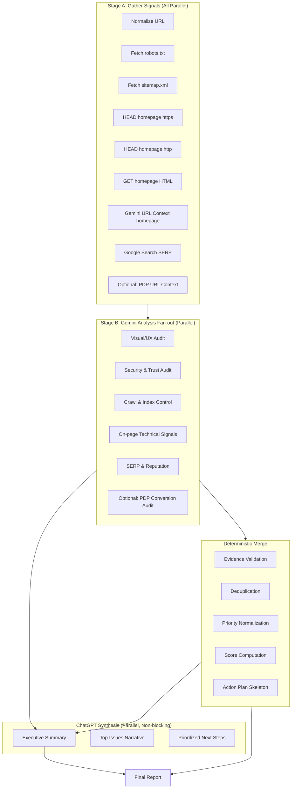

# Parallel, Evidence-Based Audit Architecture

## Overview

This document outlines the implementation of a high-performance, parallel website audit system that replaces screenshot-based analysis with URL Context and implements a provider split between Gemini (reality/tools) and ChatGPT (synthesis).

## Key Principles

1. **Max Parallelism**: Start everything that can start immediately; no serial bottlenecks
2. **No Locked Formats**: Best-effort structure only; downstream agents read flexibly
3. **Provider Split**: Gemini handles web/tools, ChatGPT handles synthesis
4. **Evidence-Based**: Every finding must include quoted evidence
5. **Progressive Delivery**: Show results as they arrive; never wait for stragglers

## Architecture Flow



## Stage A: Signal Gathering (Parallel)

All tasks start immediately with strict timeouts:

| Task | Timeout | Retry |
|------|---------|-------|
| URL Normalization | N/A | N/A |
| robots.txt fetch | 5s | 1 (transient only) |
| sitemap.xml fetch | 5s | 1 (transient only) |
| HEAD https/http | 5s | 1 (transient only) |
| GET homepage HTML | 5s | 1 (transient only) |
| Gemini URL Context | 15s | 1 (429/5xx only) |
| Google Search SERP | 15s | 1 (429/5xx only) |
| PDP URL Context | 15s | 1 (429/5xx only) |

**No task waits for any other task.**

## Stage B: Gemini Analysis Fan-out

Triggered as soon as inputs are available:

### B1. Visual and UX Audit
- **Trigger**: homepage URL Context result
- **Checks**: Above-fold messaging, CTA clarity, trust signals, navigation, mobile readiness
- **Output**: Finding/Evidence/Why/Fix blocks with exact on-page text quotes

### B2. Security and Trust Audit
- **Trigger**: headers + redirect chain + homepage HTML + robots/sitemap
- **Checks**: HTTPS enforcement, security headers, mixed content, cookie attributes, form security
- **Output**: Findings with quoted headers, redirect hops, tag snippets

### B3. Crawl and Index Control
- **Trigger**: robots + sitemap snippet
- **Checks**: robots blocks, sitemap references, URL hygiene
- **Output**: Findings with quoted robots lines and sitemap URLs

### B4. On-page Technical Signals
- **Trigger**: homepage HTML snippet
- **Checks**: title/meta, H1 hierarchy, canonical, meta robots, schema
- **Output**: Findings with quoted tags

### B5. SERP and Reputation
- **Trigger**: SERP tool results
- **Checks**: SERP appearance, indexed presence, reputation signals
- **Output**: Findings with quoted snippets and result URLs

### B6. PDP Audit (Optional)
- **Trigger**: PDP URL Context result
- **Checks**: Conversion clarity, price visibility, reviews, product schema
- **Output**: Findings with quoted PDP text

## Deterministic Merge

Mechanical operations only:

1. **Evidence Validation**: Drop findings without evidence markers ([URL_CONTEXT], [HTML], [SERP], etc.)
2. **Deduplication**: Near-duplicate detection using finding title/description similarity
3. **Priority Normalization**: Simple rules (High/Medium/Low → 1-5 scale)
4. **Score Computation**: Rule-based scoring from finding count/severity
5. **Action Plan Skeleton**: Categorized fixes without narrative

## ChatGPT Synthesis

Runs in parallel with deterministic merge:

- **Input**: Merged findings + measurement gaps + scoring state
- **Output**: Executive summary, top issues narrative, prioritized next steps
- **Fallback**: If ChatGPT fails/slow, return deterministic report only

## Progressive Delivery

```
First Paint (immediate):
├── URL Context visual audit
├── Security basics
└── Crawl basics

Then Append (as available):
├── SERP findings
├── Technical tag findings
└── PDP findings (if provided)

Final Polish (ChatGPT):
├── Executive summary
└── Prioritized recommendations
```

## Evidence Retention

Store everything gathered:

```typescript
interface EvidenceArchive {
  url: string;
  timestamp: string;
  rawSignals: {
    robots: string;
    sitemap: string;
    headers: Record<string, string>;
    redirectChain: string[];
    htmlSnippet: string;
  };
  modelOutputs: {
    urlContext: string;
    serpResults: string;
    geminiAnalyses: Record<string, string>;
    chatgptSynthesis?: string;
  };
  parseStatus: {
    droppedFindings: string[];
    parseErrors: string[];
  };
}
```

## Time Budgets and Caps

### Network Caps
- robots/sitemap/homepage: 5s timeout
- Redirect chain: max 5 hops
- HTML: truncate at 5000 chars

### Tool Caps
- URL Context: one URL per call
- SERP: capped query set (site:, brand, reviews)

### Model Caps
- Concurrency gate for rate limit protection
- "List up to N findings max" in prompts
- One retry only for 429/transient 5xx

## File Structure

```
api/
├── audit-v2.ts              # New parallel audit endpoint
├── lib/
│   ├── types.ts             # New parallel audit types
│   ├── url.ts               # URL normalization
│   ├── fetchers.ts          # Raw signal fetchers
│   ├── evidence.ts          # Evidence storage
│   ├── merge.ts             # Deterministic merge engine
│   └── chatgpt.ts           # ChatGPT synthesis client
├── stages/
│   ├── stageA.ts            # Signal gathering orchestrator
│   └── stageB.ts            # Analysis fan-out orchestrator
└── prompts/
    ├── visual.txt           # B1: Visual/UX
    ├── security.txt         # B2: Security
    ├── crawl.txt            # B3: Crawl control
    ├── technical.txt        # B4: On-page signals
    ├── serp.txt             # B5: SERP reputation
    └── pdp.txt              # B6: PDP conversion
```

## Provider Split Details

### Gemini Responsibilities
- URL Context retrieval
- Google Search tool (SERP)
- Robots/sitemap interpretation
- HTML and header interpretation
- Security header reasoning

### ChatGPT Responsibilities
- Merging outputs
- Deduplication
- Scoring logic application
- Building action plan
- Writing executive summary

**ChatGPT does NOT fetch the web.** It only reasons over Gemini outputs + raw signals.

## Implementation Phases

1. **Phase 1**: Signal gathering infrastructure (types, fetchers, evidence storage)
2. **Phase 2**: Stage A orchestrator (parallel signal gathering)
3. **Phase 3**: Stage B fan-out (6 analysis types)
4. **Phase 4**: Deterministic merge engine
5. **Phase 5**: ChatGPT synthesis integration
6. **Phase 6**: Remove screenshot dependencies
7. **Phase 7**: Time budgets and caps
8. **Phase 8**: Progressive delivery (SSE)
9. **Phase 9**: Testing and validation
10. **Phase 10**: Documentation and cleanup

## Success Criteria

- [ ] No `Promise.all` gates the entire experience
- [ ] Results stream progressively
- [ ] Every finding has quoted evidence
- [ ] ChatGPT synthesis is non-blocking
- [ ] Screenshot capture is removed
- [ ] All network calls have timeouts
- [ ] Evidence is retained for debugging
- [ ] p95 latency under control with caps
